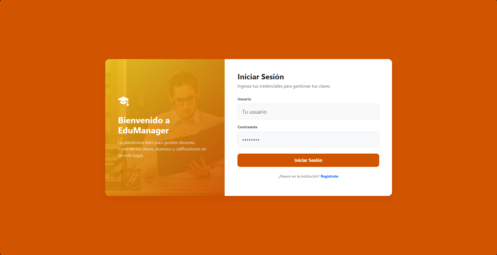
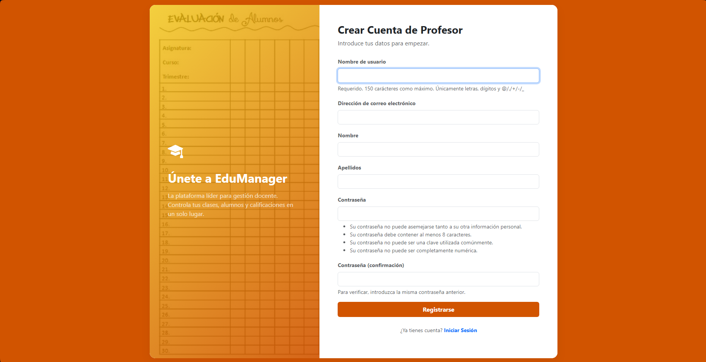
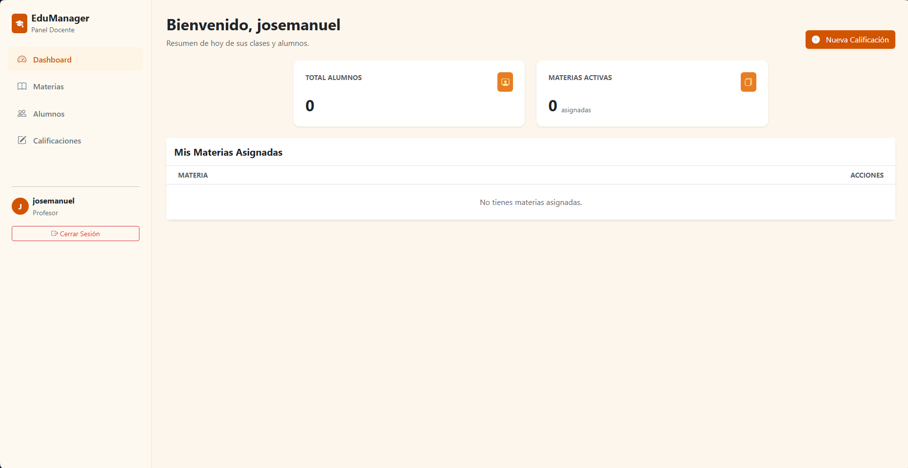
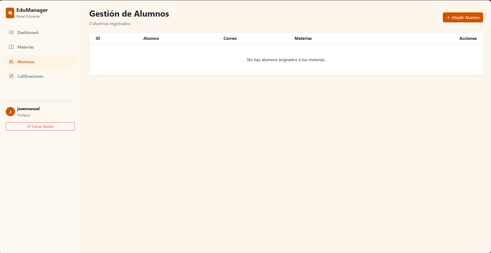
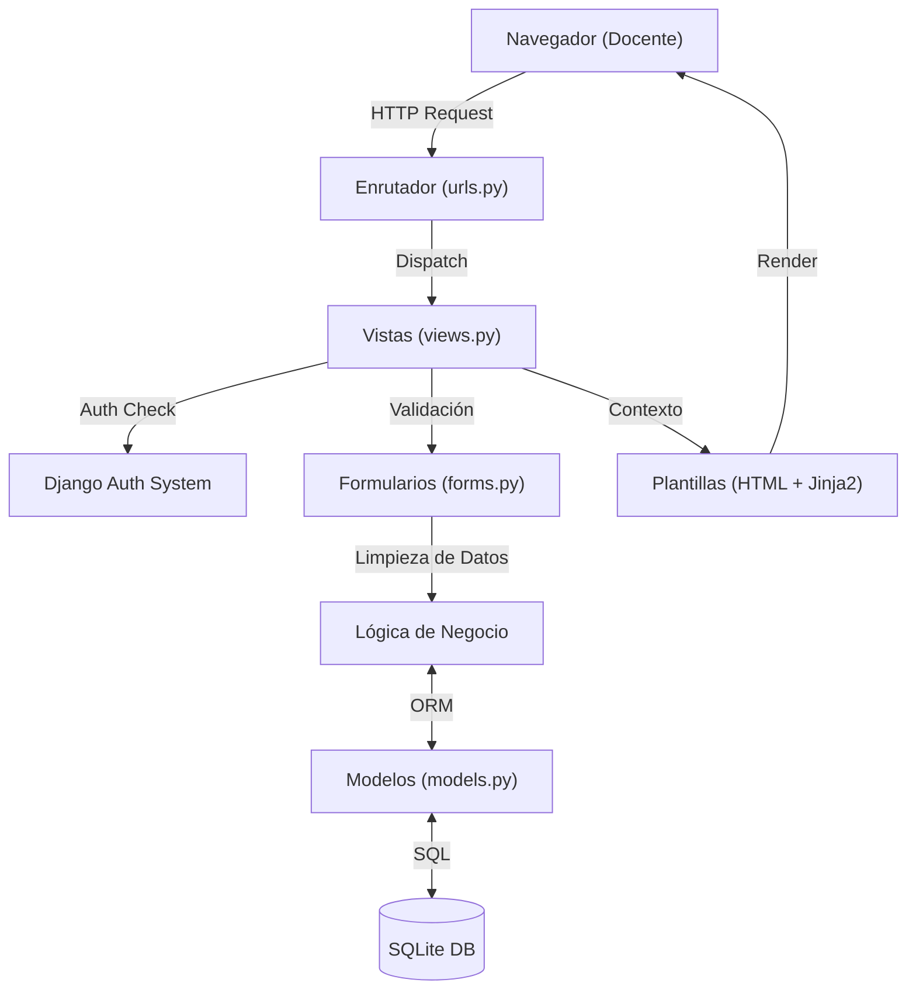

# EduManager - Sistema de Gestión Escolar para Docentes

Sistema integral de gestión académica para profesores, con control de alumnos, materias, actividades y calificaciones, diseño moderno *Fire Gradient* y autenticación segura. Construido con **Django 5**, **Bootstrap 5** y **SQLite**.



## Descripción

**EduManager** es una plataforma web diseñada para simplificar la carga administrativa de los docentes. Permite gestionar el ciclo de vida académico de manera intuitiva y visualmente atractiva.

El sistema ofrece un **Dashboard** interactivo, gestión completa (CRUD) de **Alumnos** y **Materias**, y un avanzado módulo de **Calificaciones** que valida automáticamente los datos ingresados para evitar errores. Todo ello envuelto en una interfaz moderna con una paleta de colores "Golden Academy" y componentes responsivos.

---

## Capturas de Pantalla

### 1. Autenticación y Registro
Acceso seguro para profesores con formularios estilizados y validación de usuarios.
|             Login             |              Registro               |
| :---------------------------: | :---------------------------------: |
|  |  |

### 2. Panel Principal (Dashboard)
Visión general de estadísticas clave y accesos rápidos a las funciones más usadas.


### 3. Gestión Académica
Herramientas para la administración diaria de clases y evaluaciones.

#### A. Registro de Calificaciones (Fire Gradient)
Interfaz optimizada para la carga rápida de notas con validación en tiempo real.


#### B. Listado de Materias
Gestión de asignaturas impartidas.


#### C. Menú Principal de Alumno
Vista detallada de la gestión de estudiantes.


---

## Arquitectura del Proyecto

El proyecto sigue la arquitectura **MVT (Model-View-Template)** de Django, garantizando una separación clara de la lógica de negocio, la presentación y los datos.

```
EduManager/
├── EduManager/                 # Configuración del proyecto
│   ├── settings.py             # Ajustes globales (Apps, DB, Static)
│   └── urls.py                 # Enrutador principal
│
├── app_principal/              # Aplicación Núcleo
│   ├── migrations/             # Control de versiones de BD
│   ├── static/                 # Assets (CSS, JS, Imágenes)
│   │   └── app_principal/
│   │       ├── css/            # Estilos personalizados
│   │       └── img/            # Fondos y logos
│   ├── templates/              # Plantillas HTML
│   │   ├── registros/          # Auth (Login, Registro)
│   │   └── sistemas/           # App (Dashboard, CRUDs)
│   ├── admin.py                # Panel de administración Django
│   ├── forms.py                # Formularios y validaciones
│   ├── models.py               # Modelos de datos (ORM)
│   ├── urls.py                 # Rutas de la aplicación
│   └── views.py                # Controladores y lógica
│
├── imgReadme/                  # Recursos para documentación
├── manage.py                   # Script de gestión
└── db.sqlite3                  # Base de datos local
```

### Flujo de la Aplicación



---

## Características Técnicas y Seguridad

### 1. Sistema de Calificaciones Robusto
Implementación lógica en `views.py` para asegurar la integridad de los datos académicos:
*   **Validación de Rango:** Solo se permiten notas entre 0 y 10.
*   **Anti-Duplicados:** Verificación de existencia previa de calificación para un alumno en una misma actividad (respetando `unique_together` de la BD).
*   **Validación de Pertenencia:** Asegura que el alumno esté inscrito en la materia correspondiente.

### 2. Mensajería Global e Interactiva
Sistema ux mejorado mediante `Bootstrap Toasts` y `Modals`:
*   **Alertas de Éxito:** Auto-dismissible a los 3 segundos (Top-Center).
*   **Modales de Error:** Interrupciones visuales claras para errores críticos de validación.

### 3. Autenticación Extendida
Uso del sistema de autenticación de Django ampliado con formularios personalizados que incluyen validaciones adicionales y estilos propios.

---

## Instalación y Despliegue

### 1. Requisitos Previos
*   Python 3.10+
*   Pip (Gestor de paquetes)
*   Git

### 2. Pasos de Instalación

```bash
# 1. Clonar el repositorio
git clone <url-del-repositorio>
cd EduManager  # (Omitir si ya estás dentro de la carpeta)

# 2. Crear entorno virtual
python -m venv venv

# Windows
venv\Scripts\activate  

# Linux/Mac
source venv/bin/activate

# 3. Instalar dependencias
pip install django

# Opcional: Si vas a usar MySQL en lugar de SQLite
# pip install mysqlclient

# 4. Aplicar migraciones
python manage.py migrate

# 5. Crear superusuario (OBLIGATORIO)
# La base de datos no se incluye por seguridad. Debes crear el admin.
python manage.py createsuperuser

# 6. Ejecutar servidor
python manage.py runserver
```

Accede a: [`http://127.0.0.1:8000`](http://127.0.0.1:8000)

---

## Tecnologías Utilizadas

| Tecnología          | Versión | Uso                              |
| :------------------ | :------ | :------------------------------- |
| **Django**          | 5.x     | Framework Backend Full-Stack     |
| **Python**          | 3.12    | Lenguaje de Programación         |
| **Bootstrap**       | 5.3     | Framework CSS y Componentes UI   |
| **SQLite**          | 3.x     | Base de Datos Relacional         |
| **HTML5/CSS3**      | -       | Estructura y Estilos             |
| **JavaScript**      | ES6+    | Interactividad (Modales, Toasts) |
| **Bootstrap Icons** | 1.x     | Iconografía                      |

---

## Referencias

- [Documentación Django](https://docs.djangoproject.com/)
- [Bootstrap 5 Docs](https://getbootstrap.com/docs/5.3/getting-started/introduction/)
- [Bootstrap Icons](https://icons.getbootstrap.com/)
